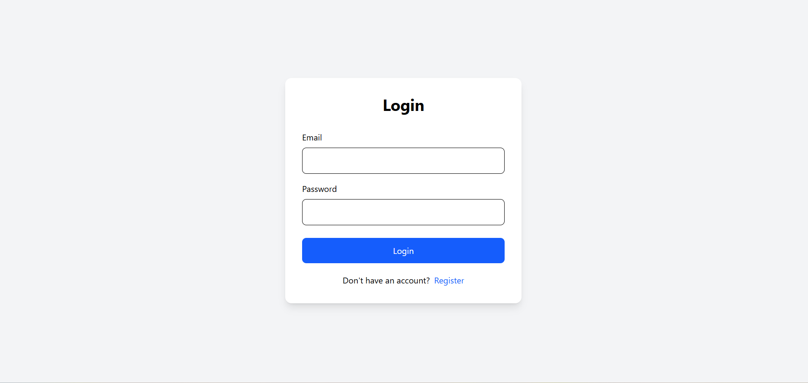
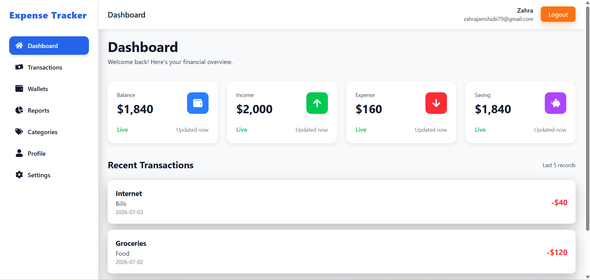
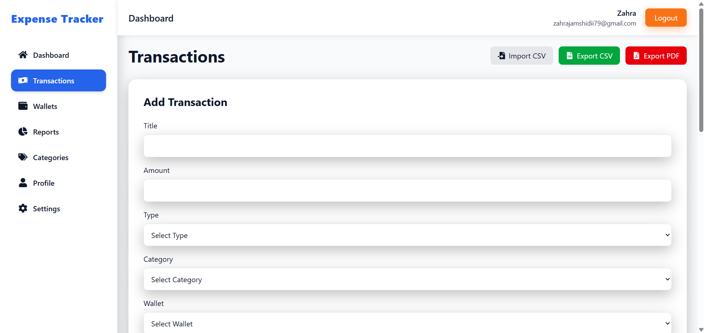
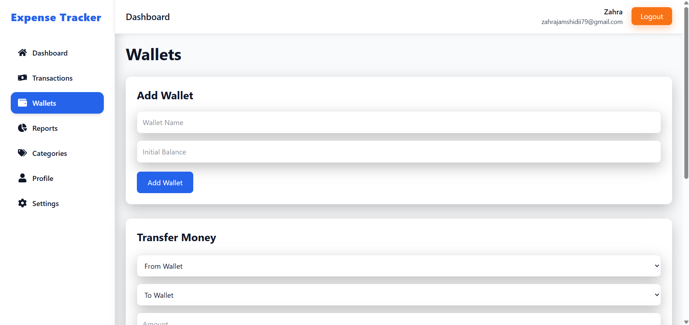
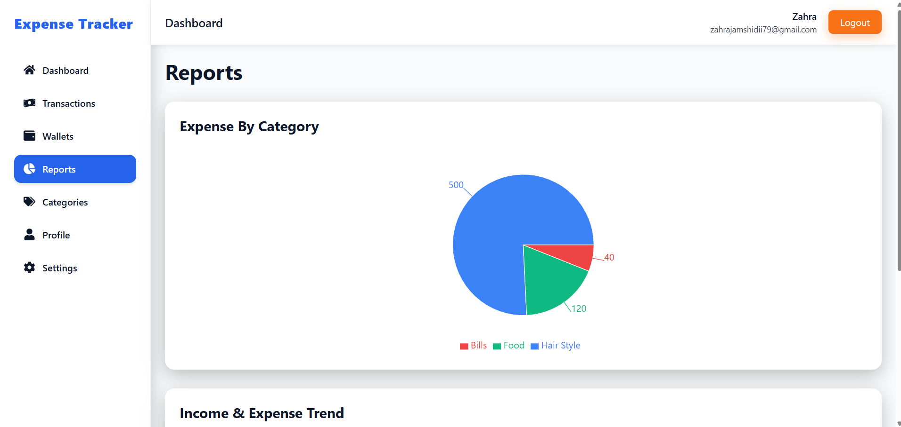
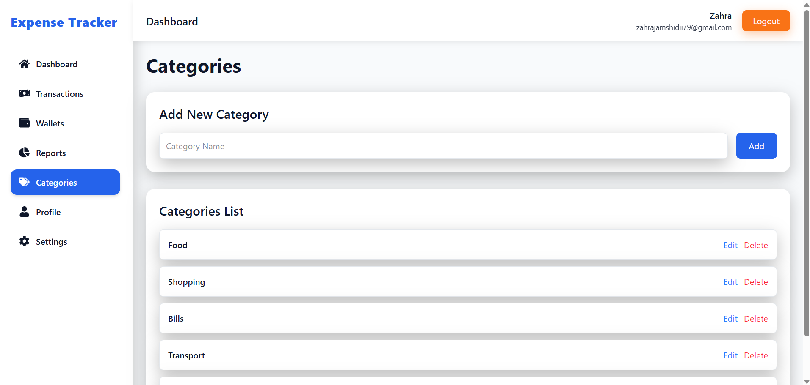
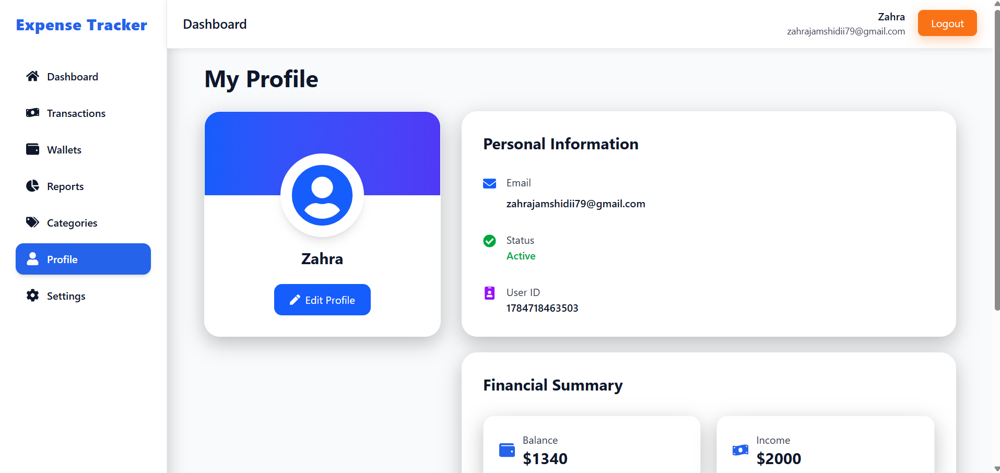
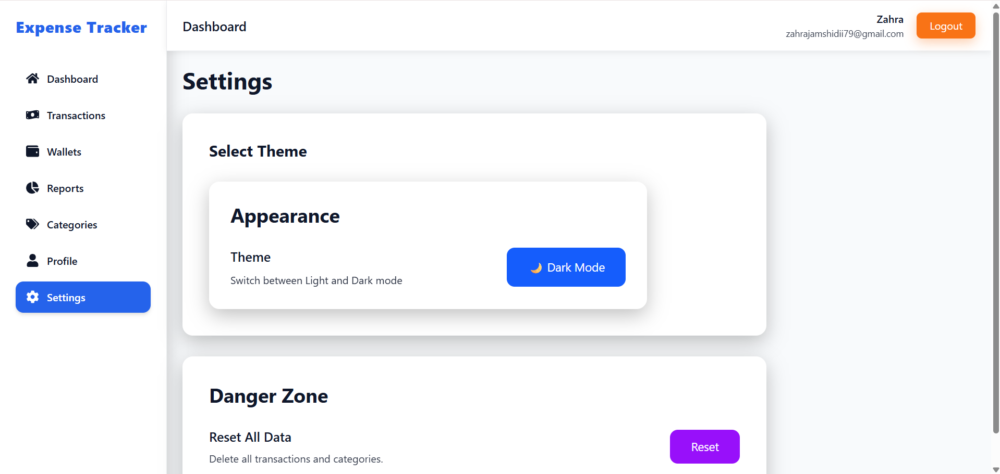

# 💰 Expense Tracker Dashboard

A modern and responsive Expense Tracker Dashboard built with **React.js** that helps users manage their personal finances efficiently.

---

## 🚀 Live Demo

👉 https://expense-tracker-react-dmfa.vercel.app

---

## 📸 Preview

## 📸 Screenshots

### Login



### Dashboard



### Transactions



### Wallets



### Reports



### Categories



### Profile



### Settings



---

## ✨ Features

### 👤 Authentication
- 🔐 Register
- 🔓 Login
- 👤 User Profile

### 💸 Transaction Management
- ➕ Add Income
- ➖ Add Expense
- ✏️ Edit Transactions
- 🗑 Delete Transactions
- 🔍 Search Transactions
- 🗂 Filter by Category
- 📅 Filter by Date Range

### 💳 Wallet Management
- Create Wallets
- Edit Wallet
- Delete Wallet
- Transfer Money Between Wallets

### 📂 Category Management
- Add Category
- Edit Category
- Delete Category

### 📊 Reports
- 📈 Income & Expense Trend Chart
- 🥧 Expense By Category Pie Chart

### ⚙️ Settings
- 🌙 Light / Dark Mode
- ♻️ Reset All Data

### 💾 Storage
- LocalStorage Persistence

### 📱 UI
- Responsive Design
- Modern Dashboard Layout

---

# 🛠 Tech Stack

- React.js
- React Router DOM
- Redux Toolkit
- Context API
- React Hook Form
- Tailwind CSS
- Recharts
- React Icons
- React Toastify
- LocalStorage
- Vite

---

# 📂 Folder Structure

```text
src/
│
├── components/
├── context/
├── features/
├── hooks/
├── layouts/
├── pages/
├── redux/
├── routes/
├── theme/
└── utils/
```

---

# ⚡ Getting Started

### Clone Repository

```bash
git clone https://github.com/ZahraJamshidii/expense-tracker-react.git
```

### Install Dependencies

```bash
npm install
```

### Start Development Server

```bash
npm run dev
```

---

# 🎯 Future Improvements

- Currency Selection
- Recurring Transactions
- Budget Planning
- Monthly Notifications
- Cloud Database
- Multi-language Support

---

# 👩‍💻 Author

### Zahra Jamshidi

Junior Front-End Developer

GitHub:
https://github.com/ZahraJamshidii
